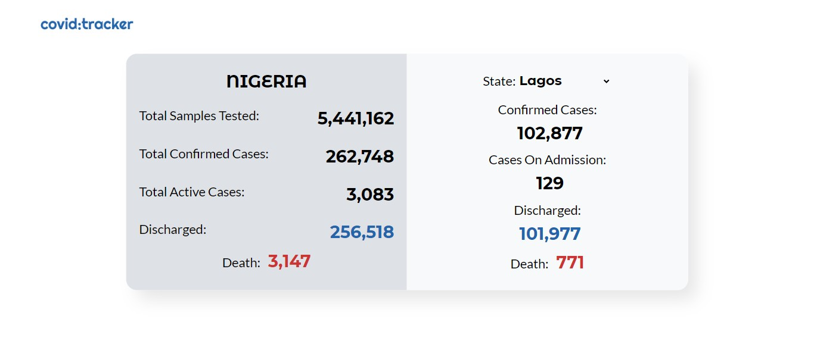
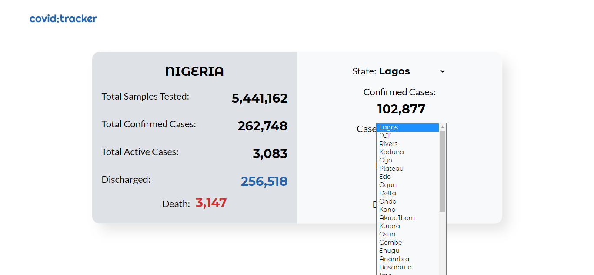

# Covid Case Tracker using Redux - Sofware Engineer Task 2

This is a solution to the [SECOND TASK(TASK 2)](https://docs.google.com/document/d/1R1tnvH2jkCFF1XHqzBLoE9D6ylUgCcdSVJom2gl5d1A/edit) for the Software Engineer Test Questions for Frontend.

## Table of contents

- [Covid Case Tracker using Redux - Sofware Engineer Task 2](#covid-case-tracker-using-redux---sofware-engineer-task-2)
  - [Table of contents](#table-of-contents)
  - [Overview](#overview)
    - [The challenge](#the-challenge)
    - [Figma Templates](#figma-templates)
    - [Screenshot](#screenshot)
    - [Links](#links)
  - [My process](#my-process)
    - [Built with](#built-with)
    - [Useful resources](#useful-resources)
  - [Author](#author)
  - [Acknowledgments](#acknowledgments)

## Overview

### The challenge

Create a single page react app that fetches data from the stated open API below using redux and display the information.

- API - [https://covidnigeria.herokuapp.com/api](https://covidnigeria.herokuapp.com/api)

### Figma Templates

- Figma Design I worked with - [Covid Case](https://www.figma.com/file/vXaakFsJdpp9ewj3JivJ2M/covid-case-tracker?node-id=0%3A1)

### Screenshot

### Links

- Solution URL: [My Solution](https://github.com/Multimarix/covid-case-tracker)
- Live Site URL: [Live Site Demo](https://covid-case-demo.netlify.app/)

## My process

### Built with

- Semantic HTML5 markup
- CSS custom properties
- Flexbox
- CSS Grid
- [React](https://reactjs.org/) - JS library
- [Styled Components](https://styled-components.com/) - For styles
- [Redux Core](https://redux.js.org/) - For State Management of the Application

### Useful resources

- [Redux Docs](https://redux.js.org/introduction/getting-started) - This helped me to look up the functions of the various redux methods and custom hooks quickly.

## Author

- Github - [DEE](https://www.your-site.com)
- Frontend Mentor - [@Multimarix](https://www.frontendmentor.io/profile/Multimarix)
- LinkedIn - [Don AKhirebhulu](https://www.linkedin.com/in/don-akhirebhulu-675082242/)

## Acknowledgments

Hats off to [pcxlz](https://github.com/pcxlz) for Designing the UI for me with popular tool [FIGMA](https://www.figma.com/) on such a quick notice. Your efforts are really appreciated.
